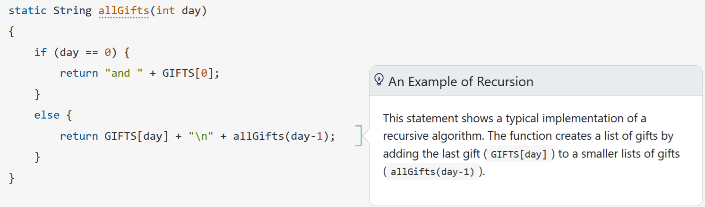

# Introduction to Software Design with Java

Companion web site for the book ["Introduction to Software Design with Java"](https://www.springer.com/gp/book/9783030240936) by Martin P. Robillard, Springer 2019 and its [second edition](https://link.springer.com/book/10.1007/978-3-030-97899-0), 2022. 

**NEW! The third edition of the book is now in production, with publication expected in January 2026.** It improves the presentation of numerous topics and provides a thoroughly revised set of code fragments that incorporate the latest features of the language (such as records and the latests APIs) and follow a more effective style. The diagrams are now included as vector graphics and follow the UML standard more closely. 

## Interactive Code Samples

You can now view all the chapter code samples with additional _on-demand documentation_ accessible directly from the code. Check out the [CodeSample.info website](https://codesample.info).

## Source Code

There are three source folders on this site:

* `code-e1` The complete and commented version of the code samples for the first edition of the book;
* `code-e2` The complete and commented version of the code samples for the second edition of the book.
* `code-e3` The complete and commented version of the code samples for the third edition of the book.
* `solutions-code` The code file for selected exercises. The code files are referenced from the appropriate solutions pages.

Although you can browse the code on GitHub, the recommended way to peruse the code samples is to [clone the repository](https://www.git-scm.com/docs/git-clone). The repository includes the configurations files necessary to build the code automatically in [Eclipse](https://www.eclipse.org/). However, because some code relies on the JavaFX library, you also need to:
1. Download the [JavaFX SDK](https://gluonhq.com/products/javafx/) and unzip it to a desired location;
2. Create a new User Library under `Eclipse -> Window -> Preferences -> Java -> Build Path -> User Libraries -> New`
3. Name it `JavaFX` and include the jars under the `lib` folder from your unzipped JavaFX download location.

## Practice Exercises

The exercises are meant to be completed in order, after studying each chapter. Exercises tagged with a star (:star:) are challenging and those tagged with a magnifying glass (:mag:) are based on the exploration of the sample applications. 

|Chapter|Exercises|Solutions|
|---|---|---|
|1|[Exercises](exercises/e-chapter1.md)|On the exercise page.
|2|[Exercises](exercises/e-chapter2.md)|On the exercise page.
|3|[Exercises](exercises/e-chapter3.md)|On the exercise page.
|4|[Exercises](exercises/e-chapter4.md)|[Solutions](solutions/s-chapter4.md)
|5|[Exercises](exercises/e-chapter5.md)|[Solutions](solutions/s-chapter5.md)
|6|[Exercises](exercises/e-chapter6.md)|[Solutions](solutions/s-chapter6.md)
|7|[Exercises](exercises/e-chapter7.md)|[Solutions](solutions/s-chapter7.md)
|8|[Exercises](exercises/e-chapter8.md)|[Solutions](solutions/s-chapter8.md)
|9|[Exercises](exercises/e-chapter9.md)|[Solutions](solutions/s-chapter9.md)

## Errata

Check the Errata for clarifications and corrections. If you spot a problem that is not listed, please check the [issues](https://github.com/prmr/DesignBook/issues) and open a new one if the problem has not yet been reported.

* [Errata for the First Edition](errata-e1.md);
* [Errata for the Second Edition](errata-e2.md);

## Acknowledgements

Thanks to [Samuel Beaubien](https://github.com/samuelbeaubien), [Hüdanur Çelik](https://github.com/hudanurk), [Neil Ernst](https://github.com/neilernst), [Benjamin Lee](https://github.com/UnHumbleBen), [Christian Joudrey](https://github.com/cjoudrey), and [joshuamanascu](https://github.com/joshuamanascu) for flagging errors via this site.

A special thanks to the software design educators who have adopted the book to support their teaching. 
*To be included in the list, please fill in [this form](https://forms.office.com/r/jjagth5cDk)*.

|Name|Institution|Course|
|---|---|---|
|[Jin Guo](http://jguo-web.com)|McGill University|Software Design|
|[Neil Ernst](http://neilernst.net)|University of Victoria|Object-Oriented Design|
|[Kostadin Damevski](http://damevski.github.io)|Virginia Commonwealth University|Software Engineering: Design and Implementation|
|[Mattia Monga](https://homes.di.unimi.it/monga)|Universit&agrave; Degli Studi Di Milano|Computer Programming II|
|[Carlo Nicola Maria Bellettini](https://www.unimi.it/it/ugov/person/carlo-bellettini)|Universit&agrave; Degli Studi Di Milano|Computer Programming II|
|[Alberto Bacchelli](https://www.ifi.uzh.ch/en/zest/team/bacchelli.html)|University of Zurich|Software Construction|
|[Gerardo Canfora](http://www.gerardocanfora.net/)|University of Sannio|Software Engineering|
|[Ivano Malavolta](https://www.ivanomalavolta.com)|Vrije Universiteit Amsterdam|Software Design|
|[Istvan David](https://istvandavid.com/)|McMaster University|Introduction to Software Development|
|[Ghizlane El Boussaidi](https://www.etsmtl.ca/etudier-a-lets/corps-enseignant/gelboussaidi)|École de Technologie Supérieure|Conception orientée objet|

## License

Unless otherwise noted, the content of this repository is licensed under a <a rel="license" href="http://creativecommons.org/licenses/by-nc-nd/4.0/">Creative Commons Attribution-NonCommercial-NoDerivatives 4.0 International License</a>. 

Copyright Martin P. Robillard 2019-2025

