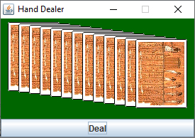

# Chapter 6 Practice Exercises

## Exercise 1

Consider interface [Show](../solutions-code/chapter6/Show.java) and the two implementing classes [Movie](../solutions-code/chapter6/Movie.java) and [Concert](../solutions-code/chapter6/Concert.java). Apply the Composite design pattern to provide support for a kind of show that is a combination of between two and five shows, inclusively. Write a client program that creates a show that consists of a concert followed by two movies, where the two movied are, together, represented by a single `Show` object.

## Exercise 2

Extend the design produced in Exercise 1 to apply the Decorator design pattern so as to provide a `IntroducedShow` feature, which consists of a show introduced by a speaker giving a fixed-time speech (e.g., 10 minutes). In client code, create a `Show` object that is an introduced version of the show created in Exercise 1, where the second movie is also introduced (so, two speakers, one presenting the entire show, and one presenting the second movie).

## Exercise 3

Draw a class diagram of your combined design for exercises 1 and 2.

## Exercise 4

Draw an object diagram of the object graph created as part of exercise 2.

## Exercise 5

Draw a sequence diagram that illustrates the sequence of method calls that results from a call to `description` on the root `Show` for the object graph depicted in Exercise 5.

## Exercise 6 

Change the code of [HandDealer.java](../solutions-code/chapter6/HandDealer.java) so that it shows a hand of 13 cards, which each card overlaid on another, as in the figure below. Once the user clicks the button, the cards should be flipped so that they are face-side up. Every subsequent button click should reveal a new, random, hand, also face-side up. Use the Composite and Decorator patterns applied to the `Icon` interface to solve the problem.

## Exercise 7

We add the following requirement to the system created and documented as part of Exercises 1-5: We need a way to obtain all the shows in a composite show so that a client can "unpack" a composite. Implement this requirement using an iterator in a way that *does not change the `Show` interface*.

## Exercise 8

Implement a variant of the feature described in Exercise 7, but this time by modifying the `Show` interface. 

## Exercise 9

Create a new class `DoubleBill` that represents a sequence of exactly two movies, but that is *not* a Decorator. Make sure your implementation respects the requirement expressed in Exercise 8.

## Exercise 10

Implement a copy constructor for `Concert`, `Movie`, and `DoubleBill`, in this order. Assume all `Show` object need to be copied deeply (which includes making copies of the object stored in fields of any type except primitive types and `String`). Then implement a copy constructor for `IntroducedShow`. Why is the solution problematic?

## Exercise 11

Add support for *polymorphic copying* into the `Show` type hierarchy. Add a `copy()` method to the `Show` interface with the semantics that it does a deep copy of the object as defined for Exercise 10.

## Exercise 12

Implement methods `equals` and `hashCode` on all implementing classes of `Show`. Consider that two composite shows are equals if they contain equal shows in the same sequence.

## Exercise 13

Using JUnit, write a unit test that checks that a copy of the object graph created as part of exercise 2 is a correct deep copy.

## Exercise 14

Complete class [Program](../solutions-code/chapter6/Program.java) so that the requirements as met, including by creating a new class that represents the absence of a show ("Null show"). It should be possible to copy instances of a Null show to respect the contracts  of the `Show.copy()` and `Program.get()` methods, but clients should also be able to determine if a given show is a Null show.

## Exercise 15

Apply the `Command` design pattern so that is is possible to clear a program, add shows to it, and remove shows from it using `Command` objects. Write a sample client code that adds two movies to a program, removes one, then clears the program (from the remaining movie). Implement commands using anonymous classes (which will require you to write factory methods for them).

## Exercise 16

Extend the design created in Exercise 14 to allow commands to be *undoable*. Extend the client code of Exercise 14 to undo all commands executed, and verify that after each command can be properly undone.

## Exercise 17

Build a `CommandProcessor` that is an abstraction that allows clients to execute commands, store executed commands, and undo the last executed command. Ensure your design respects the Law of Demeter.

## Exercise 18

Extends the `CommandProcessor` so that is supports *redoing* commands (that is, executing undone commands).

## Exercise 19

Modify your design so that the operations of a `CommandProcessor` are encapsulated within a `Program`. In other words, client code should be able to once again call `add` `remove` and `clear` on an instance of `Program` to perform these actions, but the actions would be stored as commands within a program and be undoable through an `undoLast()` method added to the interface of `Program`. How can you avoid pushing `Program` towards a God class responsible for two different things: managing a program and managing a stack of commands?

---

Unless otherwise noted, the content of this repository is licensed under a <a rel="license" href="http://creativecommons.org/licenses/by-nc-nd/4.0/">Creative Commons Attribution-NonCommercial-NoDerivatives 4.0 International License</a>. 

Copyright Martin P. Robillard 2019
