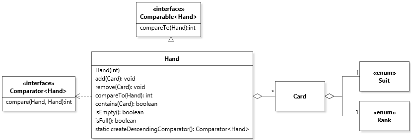

# Chapter 3 Solutions to Practice Exercises

## Exercise 1-3

See [Hand.java](../solutions-code/chapter3/Hand.java).

## Exercise 4

[Diagram File](c3-exercise4.class.jet)

## Exercise 5

See [Hand.java](../solutions-code/chapter3/Hand.java).

## Exercise 6

See [UniversalComparator.java](../solutions-code/chapter3/UniversalComparator.java).

---

Unless otherwise noted, the content of this repository is licensed under a <a rel="license" href="http://creativecommons.org/licenses/by-nc-nd/4.0/">Creative Commons Attribution-NonCommercial-NoDerivatives 4.0 International License</a>. 

Copyright Martin P. Robillard 2019