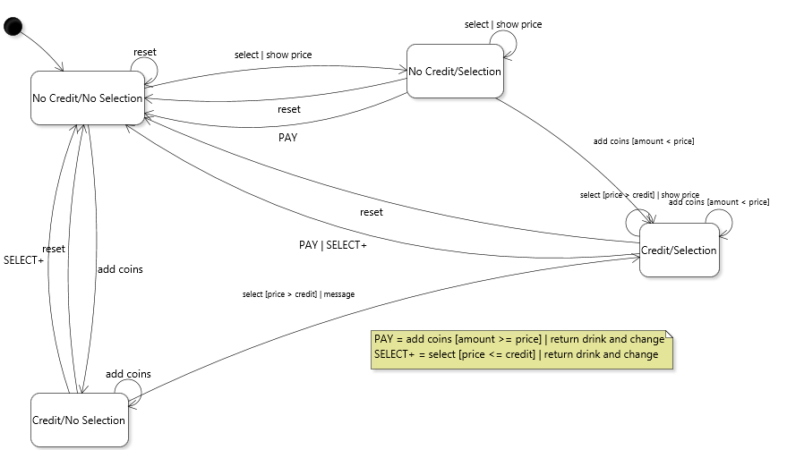

# Chapter 4 Solutions to Practice Exercises

## Exercise 1

A single one because the class yields immutable objects. Even though, as a whole, objects of class `Card` can represent 52 distinct values, a given object will only represent a single one throughout its lifetime.

## Exercise 2

*This question is good grounds for discussion, answers are intentionally not provided.*

## Exercise 3

The key insight here is that the state of the door (open or closed) needs to be reflected in the modeled abstract states. Note that the state diagram captures information on how the "start" button works. Because every state has a transition labeled "start", it means it's always possible to press the "start" button, it simply happens to do nothing except in the case where there's a balance and the door is closed. Not including the "start" self-transitions would actually be a different specification for the machine. It would mean that it is physically impossible to press the button except when it can start the machine (in the sense that the button is mechanically blocked or something). Assuming whoever uses the machine actually wants to get their dry laundry back, it makes sense to include an end state.


## Exercise 4



[Diagram file](c)

## Exercise 5

There are various solutions. Here is one possibility: [Card4.java](../solutions-code/chapter4/Card4.java), [Deck4.java](../solutions-code/chapter4/Deck4.java). This solution hides the `Joker` enumerated type from the clients, but has a non-intuitive way to construct jokers that could be easily improved with factory methods.

## Exercise 6

The constraint that we do not change the type of the field rules out using type `Optional`. Instead, we can derive a solution based on the Null Object pattern and simply create a comparator that always returns that objects are equals. This is consistent with the notion that the comparison order is initially "undefined". Technically, the private static field `NULL_COMPARATOR` could be inlined. However, to use a named null object can help clarify the role of the anonymous comparator. Additionally, this idiom provides a clean way to dynamically check if the `aComparator` field has been initialized with a value other than 
the default "null" comparator.

```java
public class Game
{
   private static final Comparator<Card> NULL_COMPARATOR = new Comparator<Card>() {
      public int compare(Card pCard1, Card pCard2)
      {
         return 0;
      }};
	
   private Comparator<Card> aComparator = NULL_COMPARATOR;
}
```

## Exercise 7

A possible solution is illustrated by the use of a [Shufflable interface](../solutions-code/chapter4/Shufflable.java) with a null `Shufflable` constant.

## Exercise 8

See a sample solution here [Card5.java](../solutions-code/chapter4/Card5.java). As usual small variations are possible.

## Exercise 9

A sample solution for this exercise can already be found in the book [code](../chapter-code/chapter4/Card.java). Try modifying it to use a `Map` to store the flyweights. 

## Exercise 10

The adapted version that uses a bidimensional array for the flyweight store can be found [here](../solutions-code/chapter4/Card10.java).

## Exercise 11

See the code [here](../solutions-code/chapter4/GameModel4.java).

---
<a rel="license" href="http://creativecommons.org/licenses/by-nc-nd/4.0/"></a>

Unless otherwise noted, the content of this repository is licensed under a <a rel="license" href="http://creativecommons.org/licenses/by-nc-nd/4.0/">Creative Commons Attribution-NonCommercial-NoDerivatives 4.0 International License</a>. 

Copyright Martin P. Robillard 2019