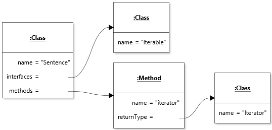

# Chapter 5 Solutions to Practice Exercises

## Exercise 1

A sample test class can be found [here](../solutions-code/chapter5/TestMin.java). How to partition the input space into unit test is somewhat discretionary (in the context of this course), but it would be important to have at least the case where the two inputs are the same given that it is mentioned in the specification, and one case where they are not the same (by extension). Given the essential logic of a `min` operation, I chose to distinguish between the cases where the minimum is the first vs. the second argument, and also checked that the minimum is the same for negative as well as positive inputs. Other cases might make sense too.

## Exercise 2

The goal of this exercise was to raise your awareness of the challenges of unit testing when floating-point values are involved, and consequently of the implications of using floating-point values as part of an interface. Because NaN refers to a specific bit pattern, it is possible to test that part of the specification exactly. However, testing for general cosine values is much trickier and requires the use of a `delta` tolerance for matching the value. See my [sample test](../solutions-code/chapter5/TestCos.java), which has one test for each of the first four quadrants of the circle. Interestingly, two of the tests fail on my machine, which raises interesting questions about the definition of "exact value" when the input is an approximation of an irrational number. 

## Exercise 3

A sample test class can be found [here](../solutions-code/chapter5/TestConcat.java). The goal of this exercise was to think about equality and identity when testing with values of reference types. Because concatenating the empty string to a string is required to return the *original* string, we must assert that the result is the *same object* as the implicit argument, not merely equal to it. Interestingly this specification is not symmetrical, so we must use `assertEquals` in the other cases, even when the implicit argument is empty. Unit testing also helps surface the disturbing fact that the behavior of `concat` is undefined when a null reference is provided as argument. In practice a `NullPointerException` is raised. I included a test to document this fact, but indicated this rationale in a comment. Note how using the concatenation operator `+` has a different behavior. 

## Exercise 4

The diagram below shows the minimal representation that includes all the types. Notice how there is no sign of generic types in the diagram. This is consistent with what you should have observed by executing or debugging a test program. Information about generic types only exists in the program source code: it is *erased* when the code is compiled into bytecode. For this reason, the run-time type of an `Iterable` is `Iterable`, not `Iterable<String>`. For the same reason, the diagram does not include any reference to a class that represents `String`.

[Diagram file](c5-exercise4.state.jet)

## Exercise 5

The following [sample solution](../solutions-code/chapter5/NumberLoader.java) provides a minimal implementation.

## Exercise 6

See this [sample solution](../solutions-code/chapter5/StringTester.java).

## Exercise 7

See this [sample solution](../solutions-code/chapter5/TestStack.java).

## Exercise 8

See methods `invokeIsStraightFlush` and `testIsStraightFlush_True` is class [TestPokerHand](../solutions-code/chapter5/TestPokerHand.java). Because there are only nine possible straight flushes per suit, we can cover all possible straight flushes with 36 test cases. However, this only covers executions that result in a `true` outcome, so it does not mean we can achieve exhaustive coverage with just 36 executions, as there are many more hand configurations that will result in a `false` outcome.

## Exercise 9

Including either method `testIsStraightFlush_WrongSuit` or `testIsStraightFlush_WrongRank` in the test suite will achieve 100% statement coverage.

## Exercise 10

Adding the remaining method in the test suite will achieve 100% branch coverage.

## Exercise 11

See this [sample solution](../solutions-code/chapter5/TestBiCardSource.java), which will reveal a seeded bug. Once you fix the bug, the suite should achieve complete branch coverage.

---

Unless otherwise noted, the content of this repository is licensed under a <a rel="license" href="http://creativecommons.org/licenses/by-nc-nd/4.0/">Creative Commons Attribution-NonCommercial-NoDerivatives 4.0 International License</a>. 

Copyright Martin P. Robillard 2019