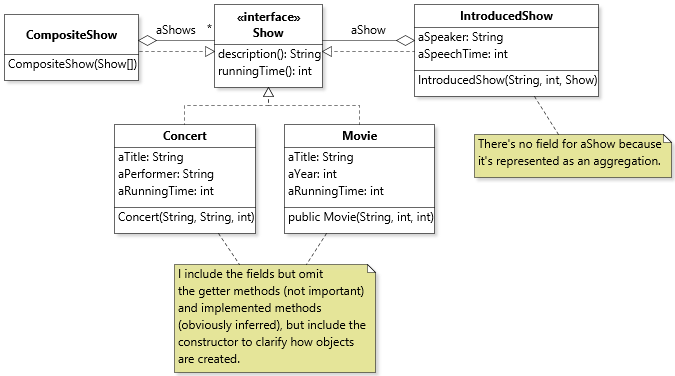
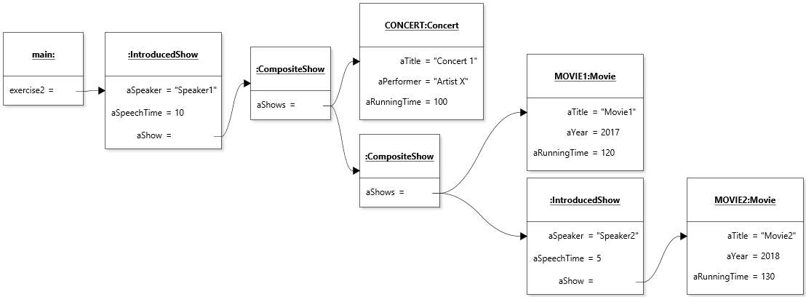
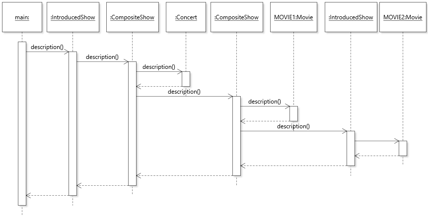
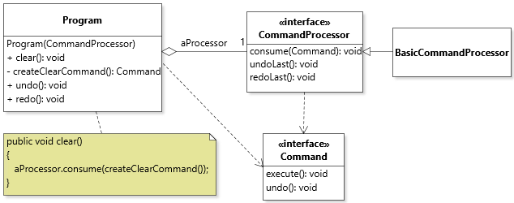

# Chapter 6 Solutions to Practice Exercises

## Exercise 1

The following is a sample [Composite](../solutions-code/chapter6/CompositeShow.java) and [Client](../solutions-code/chapter6/CompositeShow.java) (first block). Other approaches are possible to specify and enforce the cardinality constraint for initializing the composite show, e.g., design by contract or overloaded constructors.

## Exercise 2

The following is a sample [Decorator](../solutions-code/chapter6/IntroducedShow.java) and [Client](../solutions-code/chapter6/CompositeShow.java) (second block). 

## Exercise 3



[Diagram file](c6-exercise3.class.jet)

## Exercise 4



[Diagram file](c6-exercise4.object.jet)

## Exercise 5



[Diagram file](c6-exercise5.sequence.jet)

## Exercise 6

The first steps are to create helper classes [CompositeIcon](../solutions-code/chapter6/CompositeIcon.java) and [ShiftedIcon](../solutions-code/chapter6/ShiftedIcon.java). Then a method to create the desired icon becomes relatively simple. Assuming `SHIFT_X` and `SHIFT_Y` denote `int` values that represent a number of pixels.

```java
private Icon createHandIcon(Card[] pHand, boolean pHidden)
{
	CompositeIcon result = new CompositeIcon();
	for( int i = 0; i < pHand.length; i++ )
	{
		result.addIcon(new ShiftedIcon(pHidden?CardImages.getBack():CardImages.getCard(pHand[i]), SHIFT_X, SHIFT_Y));
	}
	return result;
}
```

## Exercise 7

The solution entails declaring `CompositeShow` to implement `Iterable<Show>`:

```java
public class CompositeShow implements Show, Iterable<Show>
```

This requires implementing the `iterator()` method in `CompositeShow`, which is straightforward:

```java
@Override
public Iterator<Show> iterator()
{
   return aShows.iterator();
}
```

The main benefit of declaring only `CompositeShow` to be iterable is that we avoid having to have this behavior defined for (and implemented by) classes for which it makes no sense, namely leaves such as `Concert` or `Movie`. The disadvantage is that it requires client code that works instances of `Show` to explicitly check whether an instance can be unpacked or not:

```java
Show show = ...;
if( show instanceof CompositeShow )
{
   for( Show subshow : show )
   { /* ... */ }
}
```

## Exercise 8

To add a method `iterator()` to the interface of `Show` our best bet is to declare `Show` to extend `Iterable<Show>` so that we also benefit from the subtyping relationship this introduces:

```java
public interface Show extends Iterable<Show>
```

The advantage of this solution is that client code can be more polymorphic:

```java
Show show = ...;
for( Show subshow : show ) 
{ /* ... */ } // Not executed if an empty iterator is returned.
```

The disadvantage of this approach is that an implementation of `iterator()` must also be supplied for classes that have nothing to unpack. However, with Java 8 it is a relatively minor concern because we can declare a default method that returns an empty iterator in the `Show` interface:

```java
@Override
default Iterator<Show> iterator()
{
   return Collections.emptyIterator();
}
```

## Exercise 9

For `DoubleBill` to work with `Movie` instances specifically (as opposed to `Show` instances), and thereby not be a constructor, it is simply a matter of declaring the two aggregated objects to be of type `Movie`:

```java
/**
 * Represents a show that consists of the screening of two movies
 * in sequence.
 */
public class DoubleBill implements Show
{
   private Movie aMovie1;
   private Movie aMovie2;
	
   /**
    * @param pMovie1 The first movie.
    * @param pMovie2 The second movie.
    */
   public DoubleBill(Movie pMovie1, Movie pMovie2)
   {
      aMovie1 = pMovie1;
      aMovie2 = pMovie2;
   }
	
   @Override
   public String description() 
   { 
      return String.format("%s and %s", aMovie1.description(), aMovie2.description()); 
   }

   @Override
   public int runningTime() 
   { 
      return aMovie1.runningTime() + aMovie2.runningTime(); 
   }
}

```

## Exercise 10

The copy constructor for `Movie` and `Concert` consist of trivial field initialization statements. Here is the one for `Movie`:

```java
public Movie(Movie pMovie)
{
   aTitle = pMovie.aTitle;
   aYear = pMovie.aYear;
   aRunningTime = pMovie.aRunningTime;
}
```

Here is the one for `Concert`, showing a different way of accomplishing the same thing:

```java
public Concert(Concert pConcert)
{
   this(pConcert.aTitle, pConcert.aPerformer, pConcert.aRunningTime);
}
```

The copy constructor for `DoubleBill` needs to make a copy of the underlying movies to fulfill the deep-copy requirement. This can be accomplished by using the just-implemented copy constructor for `Movie`.

```java
public DoubleBill(DoubleBill pDoubleBill)
{
   aMovie1 = new Movie(pDoubleBill.aMovie1);
   aMovie2 = new Movie(pDoubleBill.aMovie2);
}
```

The problem for `IntroducedShow` is that it aggregates an instance of the interface type `Show`. As a consequence of the polymorphism, the actual type of the `Show` object aggregated may only be known at run-time, so it is not possible to use a copy constructor in the source code without introducing a battery of inelegant and unsafe checks.

## Exercise 11

For the "leaf" classes (`Movie`, `Concert`, and `DoubleBill`) the simplest is probably to return a new object using the copy constructor. For example, for `Movie`:

```java
@Override
public Show copy()
{
   return new Movie(this);
}
```

For classes that polymorphically aggregate one or more `Show` objects, these objects must also be copied:

```java
@Override
public Show copy()
{
   return new IntroducedShow(aSpeaker, aSpeechTime, aShow.copy());
}
```

```java
@Override
public Show copy()
{
   CompositeShow copy = new CompositeShow();
   for( Show show : aShows )
   {
      copy.aShows.add(show.copy());
   }
   return copy;
}
```

One Java feature that will be introduced in more detail in Chapter 7 but that is worth mentioning here is that, in this case, it is perfectly legal to declare a return type for an implementing method that is *a subtype* of the interface method. This feature is called *covariant return types*, and it means that method `copy()` can declare to return the actual type being returned. For example:

```java
@Override
public Movie copy()
{
   return new Movie(this);
}
```

The major benefit of this is that client code that holds a reference to a `Movie` can copy that movie and assign the result to a variable of type `Movie` without casting:

```java
Movie movie = ...;
Movie copy = movie.copy();
```

## Exercise 12

For equals, in all cases the fields can be compared pairwise. This also works for `CompositeShow` given the behavior of `List.equals`:

```java
@Override
public boolean equals(Object obj)
{
   if (this == obj)
      return true;
   if (obj == null)
      return false;
   if (getClass() != obj.getClass())
      return false;
   CompositeShow other = (CompositeShow) obj;
   return Objects.equals(aShows, other.aShows);
}
```

For `hashCode`, the result of `Objects.hash` with all the fields also works.

## Exercise 13

Let's assume `fixture` is a reference to the object graph created in Exercise 2 and that `equals` and `hashCode` have been *correctly* redefined as described in Exercise 12.

```java
IntroducedShow fixture = ...;
```

Then a solution could starts as follows:

```java
@Test
public void testCopy()
{
   IntroducedShow exercise2 = ...;
   IntroducedShow copy = exercise2.copy();
   assertNotSame(exercise2, copy);
   assertEquals(exercise2, copy);
}
```
However, this test does not have very much bug-finding power because the test would still pass if references are shared within the object structure. To properly test the structure, it would be necessary to "unpack" the aggregator objects within the structure (`CompositeShow` and `IntroducedShow`). For `CompositeShow` it isn't so bad if we assume the iterator of Exercise 8 is available. However, getting at the element wrapped by `IntroducedShow` would require more work, for example the use of reflection. The end test would be a mess of iterations and tests. What is to be observed from this exercise is that using elaborate recursive structures as input and oracle is perhaps not the best way to go about testing a recursive method. Ideally, each implementation should be tested in isolation, using stubs to verify the copying is deep.

## Exercise 14

For the Null show requirement I decided to use an anonymous class and encapsulate everything within `Program` to minimize the API related to the Null show case, but other solutions are possible:

```java
public class Program
{
   private static final Show NULL = createNullShow();
	
   private static Show createNullShow() {
      return new Show() {
         @Override public String description() { return ""; }
         @Override public int runningTime() { return 0; }
         @Override public Show copy() { return createNullShow(); }
         @Override public int hashCode() { return 0; }
         @Override public boolean equals(Object pObject) 
         { return pObject != null && pObject.getClass() == this.getClass(); }
      };
   }
	
   public boolean isNull(Show pShow)
   {
      return NULL.equals(pShow);
   }
   
   /* ... */
}
```

The `clear()` method and constructor fill the program with Null shows:

```java
public Program()
{ 
   clear();
}
	
public void clear()
{
   for( Day day : Day.values() )
   {
      aShows.put(day, NULL);
   }
}
```

With this in place, the `add`, `remove`, and `get` methods don't need to do anything special:

```java
public void add(Show pShow, Day pDay)
{
   assert pShow != null && pDay != null;
   aShows.put(pDay, pShow);
}
	
public void remove(Day pDay)
{
   assert pDay != null;
   aShows.remove(pDay);
}
	
public Show get(Day pDay)
{
   assert pDay != null && aShows.containsKey(pDay);
   return aShows.get(pDay);
}
```

## Exercise 15

We need a `Command` interface:

```java
interface Command
{
	void execute();
}
```

and within class `Program` three instance methods to act as command factories:

```java
public Command createAddCommand(Show pShow, Day pDay)
{
   return new Command() {
      @Override
      public void execute()
      {
         add(pShow, pDay);				
      }
   };
}
	
public Command createRemoveCommand(Day pDay)
{
   return new Command() 
   {
      @Override
      public void execute()
      {
         remove(pDay);				
      }
   };
}
	
public Command createClearCommand()
{
   return new Command() 
   {
      @Override
      public void execute()
      {
         clear();				
      }
   };
}
```

Executing commands can now be done through command objects, e.g.:

```java
Program program = new Program();
program.createAddCommand(new Movie("Title",2000,120), MONDAY).execute();
```

## Exercise 16

The `Command` interface now needs an `undo()` method:

```java
interface Command
{
	void execute();
	void undo();
}
```

Consequently all the command factories need an implementation of `undo`. The one for undoing additions is fairly straightforward:

```java
public Command createAddCommand(Show pShow, Day pDay)
{
   return new Command() 
   {
      @Override
      public void execute()
      {
         add(pShow, pDay);				
      }

      @Override
      public void undo()
      {
         remove(pDay);				
      }
   };
}
```

For undoing removal, it's slightly more tricky as we need to keep a reference to the show that was removed (so that we can restore it). We can do with by declaring a field in our anonymous class:

```java
public Command createRemoveCommand(Day pDay)
{
   return new Command() 
   {
      Show show = aShows.get(pDay);
      @Override
      public void execute()
      {
         show = aShows.get(pDay);
         remove(pDay);				
      }
			
      @Override
      public void undo()
      {
         add(show, pDay);
      }
   };
}
```

For clearing the program, things a more involved, since it requires making a copy of the map of shows and restoring the map in `Program` using the values in the copy.

## Exercise 17

```java
public class CommandProcessor
{
   private final List<Command> aCommands = new ArrayList<>();
	
   public void consume(Command pCommand)
   {
      pCommand.execute();
      aCommands.add(pCommand);
   }
	
   public void undoLast()
   {
      assert !aCommands.isEmpty();
      Command command = aCommands.remove(aCommands.size()-1);
      command.undo();
   }
}
```

## Exercise 18

We need another stack of undone commands:

```java
public class CommandProcessor implements CommandProcessor
{
   private final List<Command> aExecutedCommands = new ArrayList<>();
   private final List<Command> aUndoneCommands = new ArrayList<>();

   @Override
   public void consume(Command pCommand)
   {
      pCommand.execute();
      aExecutedCommands.add(pCommand);
   }
	
   @Override
   public void undoLast()
   {
      assert !aExecutedCommands.isEmpty();
      Command command = aExecutedCommands.remove(aExecutedCommands.size()-1);
      command.undo();
      aUndoneCommands.add(command);
   }
	
   public void redoLast()
   {
      assert !aUndoneCommands.isEmpty();
      Command command = aUndoneCommands.remove(aUndoneCommands.size()-1);
      command.undo();
      aExecutedCommands.add(command);
   }
}
```

## Exercise 19

We can reuse our `CommandProcessor` and aggregate an object of this type within `Program`. The command factory methods can then be made private, and `Program`'s interface methods can then internally create a command and request that the processor consume it. The process is illustrated for method `clear()`. To decouple class `Program` from the implementation of a command processor, we can extract its interface, implement it, and *inject* that dependency through the constructor of `Program`.



[Diagram file](c6-exercise19.class.jet)

---
<a rel="license" href="http://creativecommons.org/licenses/by-nc-nd/4.0/"></a>

Unless otherwise noted, the content of this repository is licensed under a <a rel="license" href="http://creativecommons.org/licenses/by-nc-nd/4.0/">Creative Commons Attribution-NonCommercial-NoDerivatives 4.0 International License</a>. 

Copyright Martin P. Robillard 2019