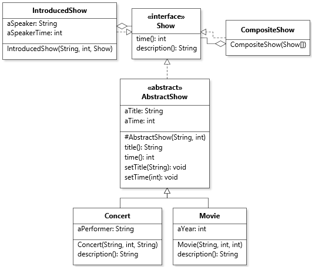
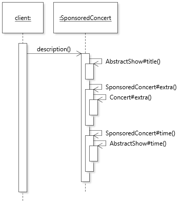

# Chapter 7 Solutions to Practice Exercises

## Exercise 1

```java
public class SponsoredConcert extends Concert
{
   private String aSponsor;
   private int aSponsorTime;

   public SponsoredConcert(String pTitle, String pPerformer, int pTime, 
      String pSponsorName, int pSponsorTime)
   {	
      super(pTitle, pPerformer, pTime);
      aSponsor = pSponsorName;
      aSponsorTime = pSponsorTime;
   }
	
   @Override
   public String description()
   {
      return String.format("%s by %s sponsored by %s", title(), aPerformer, aSponsor);
   }
	
   @Override
   public int time()
   {
      return super.time() + aSponsorTime;
   }
}

```

## Exercise 2

A solution that would make proper use of inheritance would be to access `aPerformer` through a getter method, either public or protected. 

## Exercise 3

Here is `AbstractShow`:

```java
public abstract class AbstractShow implements Show
{
   private String aTitle;
   private int aTime;
	
   protected AbstractShow(String pTitle, int pTime)
   {
      aTitle = pTitle;
      aTime = pTime;
   }
	
   public String title()
   {
      return aTitle;
   }
	
   public void setTitle(String pTitle)
   {
      aTitle = pTitle;
   }
	
   public int time()
   {
      return aTime;
   }
	
   public void setTime(int pTime)
   {
      aTime = pTime;
   }
}
```

And here is the refactored `Concert` as an example. Class `Movie` is conceptually similar:

```java
public class Concert extends AbstractShow
{
   protected String aPerformer;
	
   public Concert(String pTitle, String pPerformer, int pTime)
   {
      super(pTitle, pTime);
      aPerformer = pPerformer;
   }
	
   @Override
   public String description()
   {
      return String.format("%s by %s", title(), aPerformer);
   }
}
```

## Exercise 4

Note how the composite and decorator classes do not extend the abstract class.



[Diagram file](c7-exercise4.class.jet)

## Exercise 5

We add the follow template method in `AbstractShow`:

```java
@Override
public final String description() 
{
   return String.format("%s: %s (%d minutes", title(), extra(), time());
}

protected abstract String extra();
```

The template method need to get additional information from subclasses. This can be added to the design through the use of a call to an abstract method `extra()` that will return the extra information.

Sample implementation of `extra()` in `Concert`:

```java
@Override
protected String extra()
{
   return "by " + aPerformer;
}
```

and in `SponsoredConcert`:

```java
@Override
public String extra()
{
   return super.extra() + " sponsored by " + aSponsor;
}
```

## Exercise 6



[Diagram file](c7-exercise6.class.jet)

## Exercise 7

Both changes are examples of violation of the Liskov Substitution Principle. Adding an additional (checked) exception *forces the clients of the supertype* to catch or propagate more exception types. Adding a stricter precondition *forces the clients of the supertype* to do additional input validation before providing an argument to the function. Because of the impact on the client code, the type `Movie` is not *substitutable* for another concrete subtype of `Show`.

## Exercise 8

This is a case of *overloading*, independently of where we locate the method. Although the *name* of the method is the same, its *signature* (name and parameter types) is different. It matters where we place the method: if it is located in `AbstractShow`, we can call it on a variable of type `AbstractShow` or any of its subtypes, whereas if it is located in `Movie`, we can only call it on a variable of type `Movie` (or a subtype of `Movie`).

## Exercise 9

In this case what happens is that the version `setRecommended(Movie)` in class `Movie` *overloads* `setRecommended(Show)` in class `AbstractShow`, so in a round-about way it does *not* violate the Liskov Substitution Principle (LSP). However, there is also no dynamic binding for this method, as the target overloaded version is selected at compile-time based on the type of the argument. 

In the following code, `setRecommended(Movie)` will be selected because the type of `movie1` is `Movie`. If we change this type to `Show`, then `setRecommended(Show)` will be selected.

```java
Movie movie1 = new Movie("Metropolis", 1927, 153);
Movie movie2 = new Movie("The Good, the Bad, and the Ugly", 1966, 178);
movie2.setRecommeded(movie1);
```

The case of `getRecommended()` is different. It is possible to declare `getRecommended(): Movie` in `Movie` as a proper overriding version of `AbstractShow.getRecommended()`. More specific (or *covariant*) return types are allowed in Java (version 5 and later), and their use respects the LSP because it's always possible to assign a reference to a *more specific* type where a *more general* one is expected:

```java
// a Movie is returned, which can be assigned to a variable of type Show
Show recommended = movie2.getRecommended(); 
```

## Exercise 10

We need to change `Show` to extend `Cloneable` and declare a `clone()` method:

```java
public interface Show extends Cloneable
{
   /* ... */
	Show clone();
}
```

We can then implement `clone()` in `AbstractShow`:

```java
public AbstractShow clone()
{
   try
   {
      return (AbstractShow) super.clone();
   }
   catch(CloneNotSupportedException e)
   {
      return null;
   }
}
```

Because `Movie` and `Concert` only require shallow copies (all their fields are primitive or `String`), they can simply inherit this version because the call to `Object.clone()` will copy all fields, no matter what the run-time type is. However, we can override `clone()` to declare a covariant return type and save the client code from having to downcast. For example, in class `Movie`:

```java
public Movie clone()
{
   return (Movie) super.clone();
}
```

For subtypes of `Show` that require a deeper copy (e.g., aggregates like `CompositeShow` from Exercise 6.1), it will be necessary to make a copy of the mutable structures in the `clone()` method.

---
<a rel="license" href="http://creativecommons.org/licenses/by-nc-nd/4.0/"></a>

Unless otherwise noted, the content of this repository is licensed under a <a rel="license" href="http://creativecommons.org/licenses/by-nc-nd/4.0/">Creative Commons Attribution-NonCommercial-NoDerivatives 4.0 International License</a>. 

Copyright Martin P. Robillard 2019