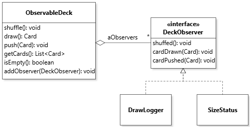
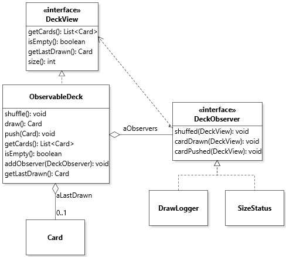
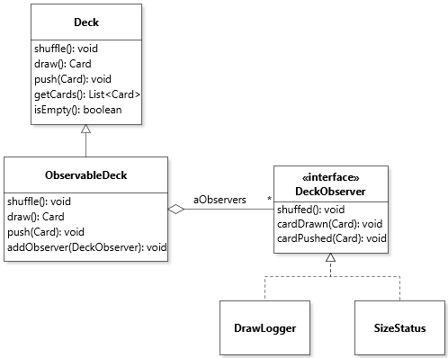
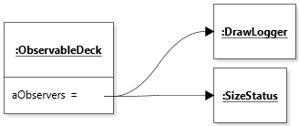
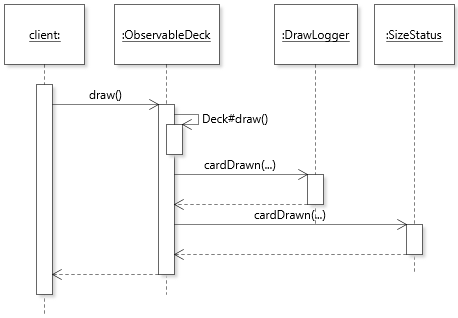
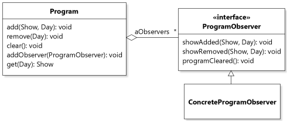
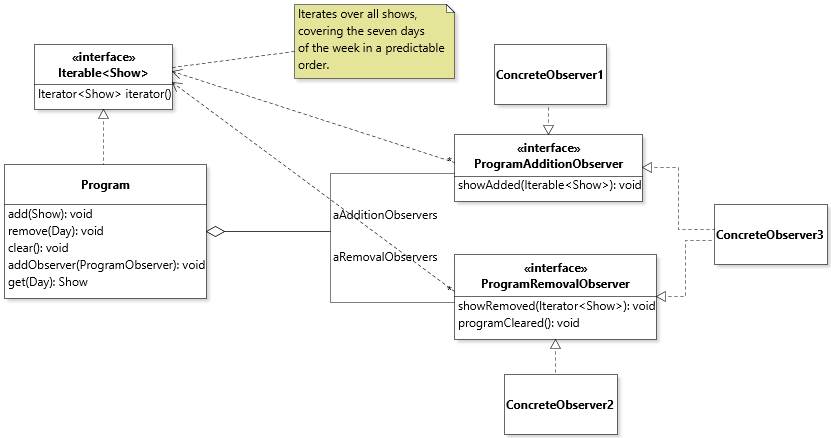
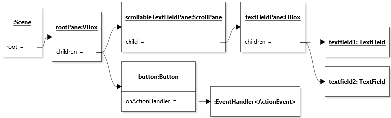

# Chapter 8 Solutions to Practice Exercises

## Exercise 1

Different variants are possible. Here is my chosen solution.



[Diagram file](c8-exercise1.class.jet)

[ObservableDeck1.java](../solutions-code/chapter8/ObservableDeck1.java)

The challenge in this question was that `SizeStatus` requires the size of the `ObservableDeck`, so it's tempting to push this information through the callbacks. However, an important principle for applying the Observer pattern is that the callbacks should reflect state changes on the model, and the data passed to callbacks should be consistent with this. The anti-pattern in this case is to overfit the design of the Observer interface to what a specific concrete observer might need. So in this case I followed the hard line and designed my three callbacks to map as directly as possible to the state changing methods of the model, and built a workaround in the `SizeStatus`, namely to compute the current size of the deck based solely on information received through the callbacks (and the assumption that the deck has 52 cards).

## Exercise 2

Different variants are possible. Here is my chosen solution.



[Diagram file](c8-exercise2.class.jet)

[ObservableDeck2.java](../solutions-code/chapter8/ObservableDeck2.java)

Here the challenge lay elsewhere, namely that normally a deck does not store cards drawn. With the pull model, this potentially useful information would become irremediably unavailable to the observers, so it becomes necessary to keep it. Ultimately, it might be a good idea to combine data pushing and pulling for an Observable deck.

## Exercise 3

The idea of factoring out some functionality into a super class is for that functionality to be reusable across different subclasses. For this reason, the general observable behavior needs to be general enough to work on multiple applications of the Observer patterns. To take it to the limit, I wrote a solution that uses the very general (but not generic!) support offered by [`java.util.Observable`](https://docs.oracle.com/javase/8/docs/api/java/util/Observable.html).

[ObservableDeck3.java](../solutions-code/chapter8/ObservableDeck3.java)

Some of the advantages of this solution are that the code of `ObservableDeck3` is now decluttered from any observer-related code expect for the notification calls. In fact, it might even make sense to call it simply `Deck`. It's also not necessary to define a new `Observer` interface, because that is in the library. 

The disadvantages are numerous:

* If we also want an instance of `Deck` that is *not* observable, we need to duplicate a lot of the class's code;
* Because Java is single-inheritance, it is not possible to have a design where `ObservableDeck` is a subclass of a class besides `Observable`; 
* We cannot design individual callbacks specific to our situation, we have to rely on a single general one offered by `Observer` and use an event type instead;
* The code we write to use `java.util.Observer` is brittle because of the downcasts required.

## Exercise 4

The first part of the solution is to declare `ObservableDeck` to extend `Deck` and declare the extra field to hold a list of observers, and a method to add to that list:

```java
public class ObservableDeck extends Deck
{
	private final List<DeckObserver> aObservers = new ArrayList<>();
	
	public void addObserver(DeckObserver pObserver)
	{
		assert pObserver != null;
		aObservers.add(pObserver);
	}
```

Then each state-changing method needs to be redefined so it triggers observer notifications:


```java
public void shuffle()
{
   super.shuffle();
   for(DeckObserver1 observer : aObservers)
   {
      observer.shuffled();
   }
}

public void push(chapter2.Card pCard)
{
   super.push(pCard);
   for(DeckObserver1 observer : aObservers)
   {
      observer.cardPushed(pCard);
   }
}
	
public Card draw()
{
   Card card = super.draw();
   for(DeckObserver1 observer : aObservers)
   {
      observer.cardDrawn(card);
   }
   return card;
}

```

The rest of the solution from Exercise 1 can remain unchanged. For this particular application of the pattern, this use of inheritance works relatively well. The code handling the observer functionality is isolated in one class, it's possible to have both `Deck` and `ObservableDeck` without much code duplication, and retain the flexibility to have our own `Observer` interface and callbacks.

## Exercise 5



[Diagram file](c8-exercise5.class.jet)



[Diagram file](c8-exercise5.object.jet)



[Diagram file](c8-exercise5.sequence.jet)

## Exercise 6



[Diagram file](c8-exercise6.class.jet)

## Exercise 7



[Diagram file](c8-exercise7.jet)

## Exercise 8

The `TextPanel` can be very easily refactored to take in any set of strings. I made the static field `LABELS` an instance field (renamed `aLabels`), and assigned its value in the constructor:

```java
class TextPanel extends HBox implements Observer
{
   private final String[] aLabels;
	
   / *...*/
	
   TextPanel(Model pModel, String... pLabels)
   {
      assert pLabels != null && pLabels.length == 11;
      aLabels = Arrays.copyOf(pLabels, pLabels.length);
```

and nothing else needs to change except the construction of the final application, which now looks like this:

```java
root.add(new TextPanel(model, ENGLISH), 0, 2, 1, 1);
root.add(new TextPanel(model, ROMAN), 0, 3, 1, 1);
```

where `ENGLISH` and `ROMAN` are constant collections of labels:

```java
private static final String[] ENGLISH = {"Zero", "One", "Two", "Three", ...
private static final String[] ROMAN = {"nullus", "I", "II", "III", "IV", ...
```

## Exercise 9

The minimal solution with an anonymous class is as follows:

```java
Label label = new Label(LocalDateTime.now().toString());
Button button = new Button("Now");
button.setOnAction(new EventHandler<ActionEvent>()
{
   @Override
   public void handle(ActionEvent event)
   {
      label.setText(LocalDateTime.now().toString());
   }
});
primaryStage.setScene(new Scene(new VBox(label, button)));
primaryStage.show();
```

An even more compact solution can be achieved with a lambda expression (Chapter 9), in which case the call to `setOnAction` becomes:

```java
button.setOnAction(e -> label.setText(LocalDateTime.now().toString()));
```

## Exercise 10

The minimal solution with an anonymous class is as follows. If you have read Chapter 9, try using a lambda expression.

```java
TextField textfield1 = new TextField("text field 1");
TextField textfield2 = new TextField("text field 2");
Button button = new Button("Swap");
button.setOnAction(new EventHandler<ActionEvent>()
{
   @Override
   public void handle(ActionEvent event)
   {
      String temp = textfield1.getText();
      textfield1.setText(textfield2.getText());
      textfield2.setText(temp);
   }
});
primaryStage.setScene(new Scene(new VBox(new HBox(textfield1, textfield2), button)));
primaryStage.show();
```

## Exercise 11

This can be achieved by wrapping the `Pane` that holds the text fields into a `ScrollPane`:

```java
primaryStage.setScene(new Scene(
   new VBox(new ScrollPane(new HBox(textfield1, textfield2)), button)));
```

To make the solution more obvious, we can extract individual parents into temporary variables:

```java
HBox textFieldPane = new HBox(textfield1, textfield2);
ScrollPane scrollableTextFieldPane = new ScrollPane(textFieldPane);
VBox rootPane = new VBox(scrollableTextFieldPane, button);
primaryStage.setScene(new Scene(rootPane));
```



[Diagram file](c8-exercise11.object.jet)

This solution shows an application of the Composite design pattern because a `Parent` (`HBox` or `VBox`) *is* a `Node` and *aggregates* multiple `Node`. The solution also shows an application of the Decorator design pattern because a `Scrollpane` *is* a `Node` and *wraps* a `Node`.

## Exercise 12

A minimal application of the Visitor pattern requires a `Visitor` interface with a visit method for each concrete node of interest:

```java
interface Visitor
{
   void visitFile(File pFile);
   void visitDirectory(Directory pDirectory);
   void visitSymbolicLink(SymbolicLink pLink);
}
```

We also need to add an `accept` method to the root of our target type hierarchy:

```java
public interface Node
{
   String name();
   void accept(Visitor pVisitor);
}
```

The implementation of `accept` for leaf nodes simply consists in a call to the appropriate `visit` method:

```java
class File extends AbstractNode
{
   /* ... */
	
   public void accept(Visitor pVisitor)
   {
      pVisitor.visitFile(this);
   }
}

class SymbolicLink extends AbstractNode
{
   /* ... */
	
   public void accept(Visitor pVisitor)
   {
      pVisitor.visitSymbolicLink(this);
   }
}
```

To implement a non-indenting `PrintVisitor` is simply a matter of printing the name of a node whenever one is encountered:

```java
public class PrintVisitor implements Visitor
{
   @Override
   public void visitFile(File pFile)
   {
      System.out.println(pFile.name());
   }

   @Override
   public void visitDirectory(Directory pDirectory)
   {
      System.out.println(pDirectory.name());
   }
	
   @Override
   public void visitSymbolicLink(SymbolicLink pLink)
   {
      System.out.println(pLink.name());
   }
}
```

To use the visitor, we create an instance of it and pass it to the `accept` method of a node:

```java
Directory root = ...;
root.accept(new PrintVisitor());
```

To add **indentation** support to `PrintVisitor` is a bit tricky, because the traversal of the node tree is triggered from the target class hierarchy (as opposed to the visitor), so implementations of `Visitor` do not have the flexibility to add instructions before and after the children of a node are traversed *without additional support*. This support can be added using *pre-* and *post-* visit methods for aggregate nodes instead of a single `visit` method. We can implement this feature by adding such methods for `Directory` nodes to the visitor interface:

```java
interface Visitor
{
   void visitFile(File pFile);
   void preVisitDirectory(Directory pDirectory);
   void postVisitDirectory(Directory pDirectory);
   void visitSymbolicLink(SymbolicLink pLink);
}
```

The implementation of `accept` for `Directory` now becomes:

```java
public void accept(Visitor pVisitor)
{
   pVisitor.preVisitDirectory(this);
   for( Node node : this)
   {
      node.accept(pVisitor);
   }
   pVisitor.postVisitDirectory(this);
}
```

With this structure, it is now possible to implement an indenting `PrintVisitor`:

```java
public class PrintVisitor implements Visitor
{
   private static final String TAB = "   ";
	
   private StringBuilder aIndent = new StringBuilder();
	
   private void indent()
   {
      aIndent.append(TAB);
   }
	
   private void unindent()
   {
      aIndent.delete(aIndent.length()-TAB.length(), aIndent.length());
   }
		
   @Override
   public void visitFile(File pFile)
   {
      System.out.println(aIndent.toString() + pFile.name());
   }
	
   @Override
   public void preVisitDirectory(Directory pDirectory)
   {
      System.out.println(aIndent.toString() + pDirectory.name());
      indent();
   }
	
   @Override
   public void postVisitDirectory(Directory pDirectory)
   {
      unindent();
   }

   @Override
   public void visitSymbolicLink(SymbolicLink pLink)
   {
      System.out.println(aIndent.toString() + pLink.name());
   }
}
```

## Exercise 13

For this version we can return to our simple abstract visitor:

```java
interface Visitor
{
   void visitFile(File pFile);
   void visitDirectory(Directory pDirectory);
   void visitSymbolicLink(SymbolicLink pLink);
}
```

We will implement default behavior in an `AbstractVisitor`. Strictly speaking the class does not need to be declared `abstract` because it's possible and not harmful to instantiate it, but the declaration helps further clarify our intent and it's also not harmful to declare it `abstract`.

```java
public abstract class AbstractVisitor implements Visitor
{
   @Override
   public void visitFile(File pFile)
   {}

   @Override
   public void visitDirectory(Directory pDirectory)
   {
      for( Node node : pDirectory )
      {
         node.accept(this);
      }
   }
   
   @Override
   public void visitSymbolicLink(SymbolicLink pLink)
   {}
}
```

Because the graph traversal code is in the visitor, we can remove it from `Directory.accept`, which now looks like the other `accept` methods:

```java
public void accept(Visitor pVisitor)
{
   pVisitor.visitDirectory(this);
}
```

Finally, our `PrintVisitor` can be written as a subclass of `AbstractVisitor`:

```java
public class PrintVisitor extends AbstractVisitor
{
   private static final String TAB = "   ";
	
   private StringBuilder aIndent = new StringBuilder();
	
   private void indent()  
   {
      aIndent.append(TAB);
   }
	
   private void unindent()
   {
      aIndent.delete(aIndent.length()-TAB.length(), aIndent.length());
   }
		
   @Override
   public void visitFile(File pFile)
   {
      System.out.println(aIndent.toString() + pFile.name());
   }
	
   @Override
   public void visitDirectory(Directory pDirectory)
   {
      System.out.println(aIndent.toString() + pDirectory.name());
      indent();
      super.visitDirectory(pDirectory);
      unindent();
   }

   @Override
   public void visitSymbolicLink(SymbolicLink pLink)
   {
      System.out.println(aIndent.toString() + pLink.name());
   }
}
```

---
<a rel="license" href="http://creativecommons.org/licenses/by-nc-nd/4.0/"></a>

Unless otherwise noted, the content of this repository is licensed under a <a rel="license" href="http://creativecommons.org/licenses/by-nc-nd/4.0/">Creative Commons Attribution-NonCommercial-NoDerivatives 4.0 International License</a>. 

Copyright Martin P. Robillard 2019